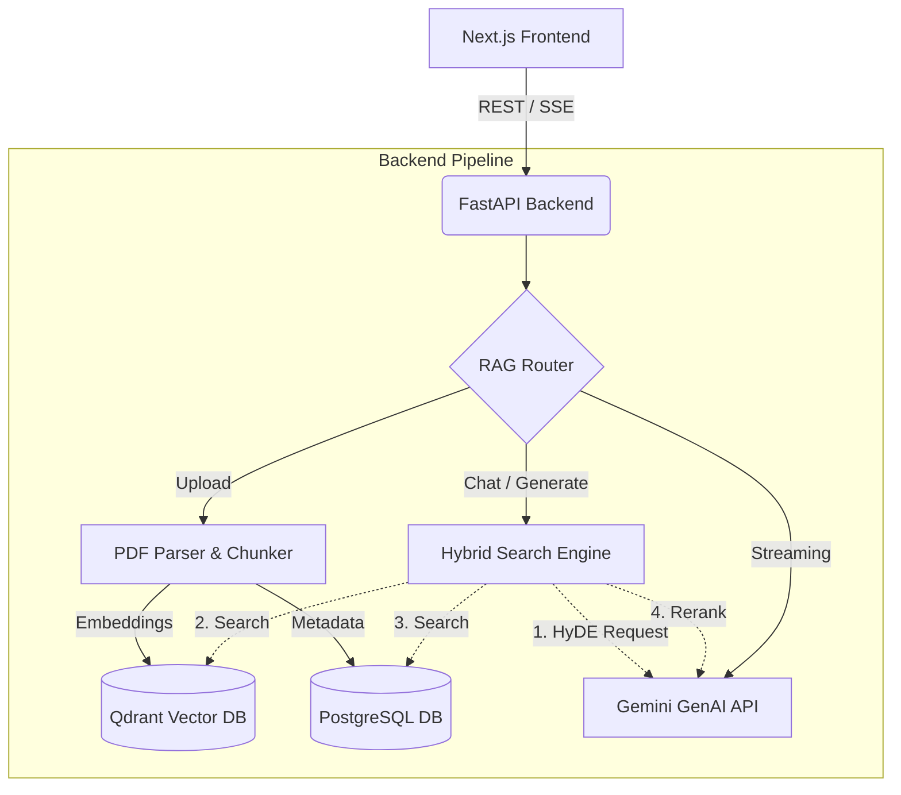

# BidMindAI (Bid Management AI)

BidMindAI는 방대한 이전 제안서 및 입찰(Bid) 관련 문서(PDF)를 기반으로 지식 창고(Knowledge Base)를 구축하고, 이를 바탕으로 실시간 질의응답 및 맞춤형 제안서를 자동 생성해주는 **RAG(Retrieval-Augmented Generation) 기반 지능형 챗봇 파이프라인**입니다.

## 🌟 주요 기능 (Key Features)

1. **지능형 문서 파이프라인 (PDF Ingestion)**
   - PyMuPDF, pdfplumber, Tesseract OCR을 통한 텍스트, 표, 스캔본 병합 추출.
   - Langchain의 RecursiveCharacterTextSplitter를 활용한 최적의 청킹(Chunking).
2. **복합 검색 엔진 (Hybrid Search Pipeline & RRF)**
   - **HyDE (Hypothetical Document Embeddings)**: 사용자 질문으로부터 가상의 이상적 답변을 미리 생성해 검색 품질 극대화.
   - **Qdrant (Dense Vector Search)**: `gemini-embedding-2-preview`을 활용한 의미론적 벡터 검색.
   - **PostgreSQL (Sparse Keyword Search)**: Full-Text Search를 활용한 정확한 키워드 매칭.
   - **RRF & Reranker**: 두 검색 결과를 Reciprocal Rank Fusion으로 융합한 뒤, `gemini-2.5-flash` 모델을 통해 문맥적 관련성으로 최종 재정렬.
   - **문서 필터링 (Document Filtering)**: 특정 문서만 선택하여 검색 범위를 제한할 수 있어 더욱 정확한 답변 생성 가능.
3. **실시간 AI 챗봇 (Streaming Chat API)**
   - RAG으로 검색된 사내 문서를 컨텍스트로 활용하여 출처 기반의 정확한 답변을 제공합니다. (SSE 스트리밍)
   - 업로드된 문서 중 원하는 문서만 선택하여 대화 가능.
4. **제안서 자동 생성 (Proposal Generator)**
   - 주제와 요구사항을 입력하면 고도화된 추론 모델(`gemini-2.5-pro`)이 목차 구조(요약, 해결책, 방법론, 예산 등)에 맞춘 상세 제안서를 SSE로 실시간 스트리밍합니다.
   - 특정 문서만 선택하여 해당 문서 기반으로 제안서 생성 가능.

---

## 🏗️ 시스템 아키텍처 (Architecture)



### 기술 스택 (Tech Stack)
- **Frontend**: Next.js 14, React, 순수 CSS (Glassmorphism & Dynamic UI)
- **Backend**: FastAPI, SQLAlchemy, Langchain, PyMuPDF, Pytesseract
- **Database**: PostgreSQL (메타데이터 및 Sparse 검색), Qdrant (Dense 벡터 검색)
- **AI Models**: Google Gemini (Flash, Pro, Embedding)

---

## ⚙️ 설치 및 실행 방법 (How to Run)

### 1. 환경 변수 설정
프로젝트 루트 디렉토리에 있는 `.env.example` 파일을 복사하여 `.env` 파일을 생성하고 변수를 채워 넣습니다.
특히 `GEMINI_API_KEY` 발급이 필수적입니다.

```bash
cp .env.example .env
# .env 파일을 열고 API KEY 및 DB 접속 정보를 알맞게 수정하세요.
```

### 2. 백엔드 및 인프라 실행 (Docker Compose)
안정적인 백엔드 동작을 위해 Qdrant, PostgreSQL이 함께 구성된 Docker를 실행합니다.

```bash
# 컨테이너 빌드 및 백그라운드 실행
docker-compose up --build -d
```
> 백엔드 서버는 `http://localhost:8000` 에서 실행되며, Swagger API 문서는 `http://localhost:8000/docs` 에서 확인할 수 있습니다.
> Qdrant 대시보드는 `http://localhost:6333/dashboard` 에 위치합니다.

### 3. 프론트엔드 실행
백엔드가 실행된 상태에서 새로운 터미널을 열고 Next.js 서버를 가동합니다.

```bash
cd frontend
npm install

# 개발 서버 실행
npm run dev
```

웹 브라우저를 열고 `http://localhost:3000` 로 접속하면 BidMindAI 대시보드 화면을 사용할 수 있습니다.

---

## 🔒 운영 전환 시 고려사항 (Sprint 8)
현재 프로젝트는 개발 완료 상태이나, 실제 프로덕션(운영) 서버에 배포할 경우 아래 항목(Sprint 8)들의 적용을 권장합니다.
- **캐싱 (Redis)**: 중복되는 HyDE 생성 및 잦은 시스템 지시어 요청에 대한 결과값 캐싱 응답 체계.
- **보안 (Security)**: JWT 기반 사용자 인증, RBAC(역할 기반 접근 제어), API Rate Limiting 도입.
- **모니터링 (Monitoring)**: Prometheus & Grafana를 활용하여 API 호출 레이턴시, Qdrant 리소스 점유율 및 LLM 토큰 소모량 추적.
